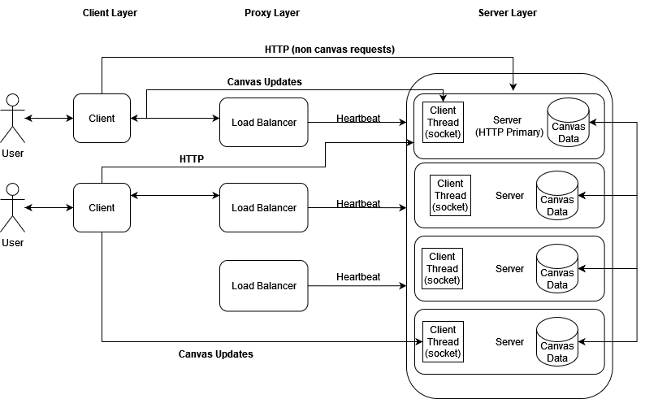
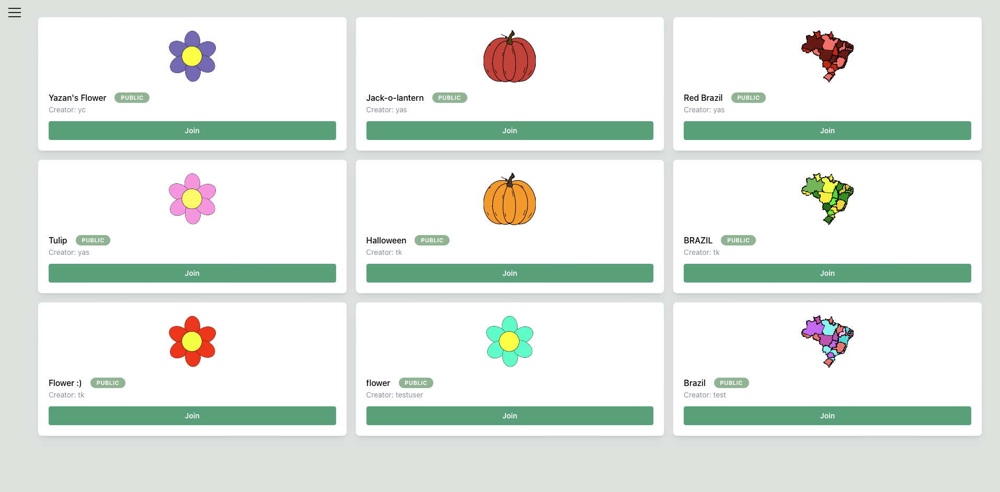

# CPSC-559-Project

## Application Description

- [Frontend](frontend/README-FRONTEND.md)
- [Proxy](proxy/README-PROXY.md)
- [Backend](backend/README-SERVER.md)

## How To Run

1. Install Docker Desktop and docker-compose
1. Clone this repo
1. go to `docker-compose.yml` and modify the values as needed (environments variables, ports, etc.)
1. **Run `docker-compose up --build -d` to bring up the services**
   - The backends start and are exposed on ports `5001`-`5004`
   - The frontend is started and exposed on port `3001`
   - MongoDB containers (`database` services) start and are exposed on port `27017`. Data is stored on the `mongo-data` volume (on your machine's filesystem)
   - Mongo Express containers start and are exposed on port `8081`-`8084`
   - Run `docker-compose down` to bring down all the containers
   - Containers can be viewed in the Docker Desktop UI
1. Go to the mongo-express services (`localhost:8081`-`localhost:8084`) to manage the MongoDB databases and add SVGs using their JSON representation (sunflower/pumpkin/brazil in the `templates` dir). The templates have to be inserted through the mongo-express services to be accessed by all servers in the system (copy the templates into each template test collection).
1. This submission already has a pre-populated database with 1 User, 3 Templates, and 3 Workspaces (canvases)
   - The sample user's username is `test` and their password is `123`.

### Deployment

In order to test the system in a realistic environment ngrok is used to expose the ports of each of the backend instances that ngrok communicates with. Because the Ngrok Urls are tied to one device a separate Ngrok branch exists to expose the ports. When live, the develop branch is designed to be only be accessed by local clients. The ngrok functionality requires authentication details, so we recommend testing the system locally with Docker and viewing the functionality of different processes in the container.

### Application Screenshot

## Sample SVG Templates

Sample Templates can be seen in the `templates` directory. These documents can be manually added into the MongoDB databases. It is expected that a system administrator would do this as part of the setup of this application.
